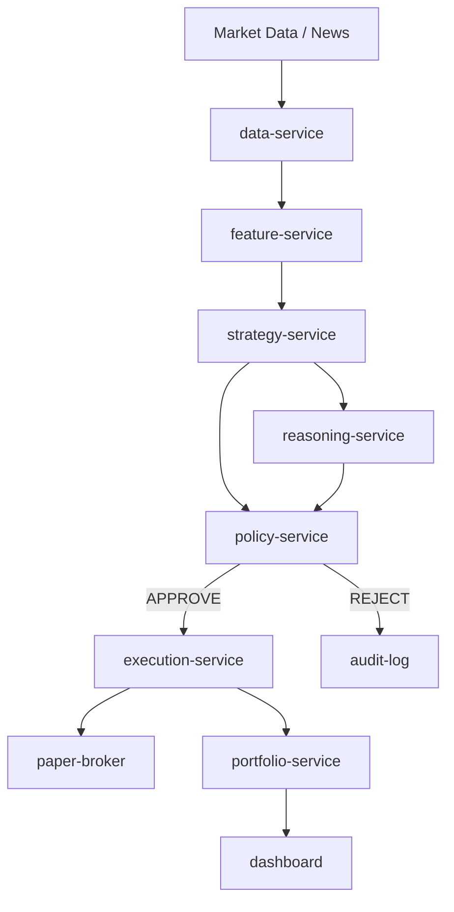

**true engineering specification (PROJECT_SPEC_V2.md)**.
This version adds the missing parts you identified:

* Exact **APIs**
* **Event model**
* **Storage design**
* **Execution semantics**
* **Reasoning-service boundaries**
* **Formal policy semantics**
* **Testing plan**
* **Rollout plan**
* **Concrete milestone**

You can paste this **directly as `PROJECT_SPEC_V2.md`** in your repo and use it with Codex.

---

# PROJECT_SPEC_V2.md

# AI Trading Stack – Engineering Specification

## 1. Purpose

This specification defines the architecture and implementation requirements for a **safe AI-assisted trading system**.

The system must:

* separate reasoning from execution
* enforce deterministic risk controls
* support paper trading before live trading
* allow AI-assisted development via AAHP

---

# 2. Non-Goals

The following are **explicitly out of scope for MVP**:

* autonomous live trading
* multi-broker support
* options strategies
* portfolio optimization
* reinforcement learning training pipelines
* large LLM agent orchestration

---

# 3. System Architecture



---

# 4. Services

## data-service

Responsibilities:

* ingest market data
* normalize symbols
* timestamp validation
* publish feature inputs

Storage:

* Redis: latest quotes
* Parquet: historical bars
* retention: permanent

Endpoints:

```
GET /v1/market/quote/{symbol}
GET /v1/market/bar/{symbol}
```

Events:

```
market.quote.updated
market.bar.closed
```

---

## feature-service

Responsibilities:

* compute indicators
* generate model features
* provide feature snapshots

Endpoints:

```
GET /v1/features/{symbol}
```

Output schema:

```
FeatureSnapshot
```

---

## strategy-service

Responsibilities:

* generate signal candidates
* deterministic strategies only (MVP)

Endpoints:

```
POST /v1/signals/generate
```

Output:

```json
{
  "signal_id": "uuid",
  "symbol": "AAPL",
  "candidate_action": "BUY",
  "confidence": 0.71,
  "size_pct": 0.02,
  "model_version": "v0.1"
}
```

Events:

```
signal.candidate.created
```

---

## reasoning-service

Purpose:

Provide LLM reasoning but never control execution.

### Input

```
SignalCandidate
MarketContext
PortfolioSnapshot
NewsSummary
```

### Output schema

```
ReasoningMemo
```

Example:

```json
{
 "signal_id": "uuid",
 "thesis": "Momentum continues after earnings revision",
 "counter_thesis": "Macro event tomorrow",
 "risk_flags": ["earnings_proximity"],
 "recommendation": "ALLOW_WITH_CAUTION"
}
```

### Validation

Rules:

```
output must be valid JSON
schema validated with Pydantic
```

### Retry behavior

```
1 invalid JSON → retry with repair prompt
2 failures → reasoning_status = FAILED
policy-service receives reasoning_status
```

### Timeout

```
soft timeout: 8 seconds
hard timeout: 15 seconds
```

### Token limits

```
max input tokens: 5000
max output tokens: 700
```

---

## policy-service

Purpose:

Deterministic risk gate.

### Endpoint

```
POST /v1/policy/evaluate
```

### Request

```json
{
 "signal_id": "uuid",
 "symbol": "AAPL",
 "candidate_action": "BUY",
 "confidence": 0.71,
 "size_pct": 0.02,
 "market_context": {
   "data_age_seconds": 12,
   "market_open": true,
   "event_blackout_active": false
 },
 "portfolio_context": {
   "gross_exposure_pct": 0.25,
   "daily_drawdown_pct": 0.01
 }
}
```

### Response

```json
{
 "decision": "APPROVE",
 "reasons": [],
 "approved_size_pct": 0.01,
 "expires_at": "ISO8601"
}
```

---

# 5. Policy Semantics

### Hard Reject Rules

```
market_open == false
data_age_seconds > 30
symbol not in allowlist
daily_drawdown_pct >= 0.03
event_blackout_active == true
liquidity_score < 0.7
```

### Review Rules

```
confidence < 0.6
reasoning recommendation == ALLOW_WITH_CAUTION
portfolio correlation > 0.35
```

### Precedence

```
REJECT > REVIEW > APPROVE
```

---

# 6. Execution Service

Responsible for broker interaction.

### Endpoint

```
POST /v1/orders
```

### Request

```json
{
 "signal_id": "uuid",
 "symbol": "AAPL",
 "side": "BUY",
 "qty": 10,
 "order_type": "MARKET"
}
```

### Required header

```
Idempotency-Key
```

---

## Idempotency Rules

```
same key + same payload → return original response
same key + different payload → HTTP 409
```

---

## Order Lifecycle

```
NEW
ACCEPTED
PARTIALLY_FILLED
FILLED
REJECTED
CANCELLED
```

Transitions:

```
NEW → ACCEPTED
ACCEPTED → FILLED
ACCEPTED → PARTIAL
ACCEPTED → CANCEL_PENDING
```

---

## Reconciliation

Polling interval:

```
5 seconds
```

Reconciliation key:

```
external_order_id
```

Source of truth:

```
broker execution state
```

Portfolio state reconciled afterward.

---

# 7. Storage Design

## execution-service

Database:

Postgres

Tables:

```
orders
fills
execution_events
```

Retention:

```
permanent
```

---

## policy-service

Tables:

```
policy_evaluations
policy_rule_hits
```

Retention:

```
180 days
```

---

## portfolio-service

Tables:

```
positions
portfolio_snapshots
pnl_history
```

---

## data-service

Storage:

```
Redis → latest quotes
Parquet → historical bars
```

---

# 8. Event Model

Events published via NATS/Kafka.

Topics:

```
market.quote.updated
signal.candidate.created
policy.decision.made
order.submitted
order.filled
order.rejected
```

---

# 9. Testing Strategy

## Unit tests

Coverage target:

```
85% policy-service
85% execution-service
70% reasoning-service
```

Test cases:

```
policy rule evaluation
order idempotency
state transitions
contract validation
```

---

## Integration tests

Flows:

```
signal → policy → execution
reasoning → policy review
broker rejection
stale data rejection
```

---

## Replay tests

Deterministic replays:

```
fixed historical signals
expected policy outcomes
expected order states
```

---

# 10. Rollout Plan

## Milestone 0

Local dev.

```
fake signals
paper broker
```

---

## Milestone 1

Paper trading.

```
real market data
5 symbols
no overnight positions
```

---

## Milestone 2

Sandbox broker.

```
manual approval required
max trade size $100
```

---

## Milestone 3

Small live capital.

```
max daily loss $50
kill switch enabled
```

---

# 11. Milestone 1 Scope

Goal:

Deterministic paper trading core.

Components:

```
libs/contracts
policy-service
execution-service
paper broker
strategy-service (fake signals)
dashboard
```

Out of scope:

```
reasoning-service
live brokers
RL training
```

Definition of done:

```
policy evaluation endpoint works
orders endpoint works
fake signal can produce paper trade
order lifecycle visible in dashboard
integration tests pass
```

---

# 12. AAHP Development Workflow

Directory:

```
.ai/handoff/
```

Structure:

```
manifest.json
task_briefs/
summaries/
decisions/
prompts/
```

Purpose:

```
limit context
enable multi-agent collaboration
preserve architecture decisions
```

---

# 13. First Codex Task

Prompt:

```
Bootstrap Python monorepo for AI trading stack.

Read only:
docs/architecture.md
PROJECT_SPEC_V2.md

Create:
services/policy-service
services/execution-service
libs/contracts
tests
README.md
docker-compose.yml
Makefile

Requirements:
Python 3.11
FastAPI
Pydantic
Postgres
paper broker adapter
unit tests required

After completion write:
.ai/handoff/summaries/TASK-000-bootstrap.md
```

---

# 14. Tech Stack

```
Python 3.11
FastAPI
Pydantic
Postgres
Redis
NATS or Kafka
DuckDB
Docker
Prometheus
Grafana
```

---

# 15. Safety Requirements

Before live trading:

```
paper trade for multiple weeks
max 0.5% risk per trade
daily drawdown stop
kill switch
stale data rejection
human override
```

---

# End of Spec

