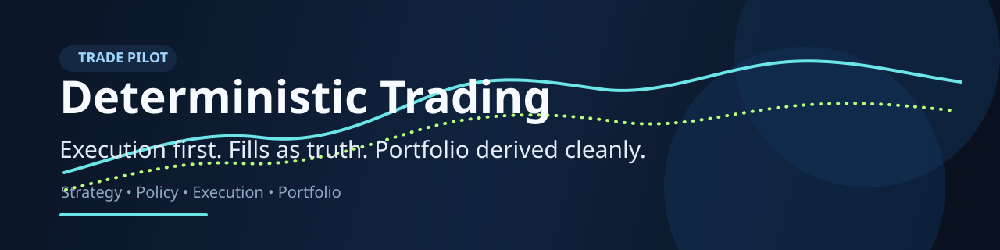

# Trade_pilot — Autonomous Trading Platform

An intraday trading stack where strategy proposes, policy approves, execution
fills, and portfolio reconciles — with the measurement and gating needed to
decide whether any of it should be trading real money.

**Status, stated plainly.** The pipeline runs end to end against a paper broker
and a real-time data feed. It has never been validated against live market
data in this repository's CI, and no strategy here has demonstrated an edge —
the tooling to test that claim is built (see
[Is the Edge Real, or Fitted?](#is-the-edge-real-or-fitted)), and running it is
your job before any money is involved. The defaults are deliberately
conservative: nothing trades until it is registered and promoted.

## Where to start

| If you want to… | Read |
|---|---|
| Run it locally on delayed data | [Running in Demo Mode](#running-in-demo-mode) |
| Trade on real-time intraday bars | [Real-Time Intraday Trading](#real-time-intraday-trading) |
| Know whether the strategy makes money | [Does the Strategy Actually Work?](#does-the-strategy-actually-work) |
| Know whether that result is real or fitted | [Is the Edge Real, or Fitted?](#is-the-edge-real-or-fitted) |
| Run more than one strategy | [Strategies and the Portfolio](#strategies-and-the-portfolio) |
| Control what is allowed to trade | [The Strategy Lifecycle](#the-strategy-lifecycle) |
| See what an order actually cost | [Execution Quality](#execution-quality) |
| Understand why a trade lost | [Explaining Trades After the Fact](#explaining-trades-after-the-fact) |
| Go live | [Enabling Live Mode](#enabling-live-mode-step-by-step) |

Operational procedures — what to do when something breaks — are in
[RUNBOOK.md](RUNBOOK.md).

## Architecture

```text
┌─────────────────────────────────────────────────────────────────┐
│                    Autonomy Orchestrator :8007                  │
│   scheduler → signals → risk → policy → ROSTER → execute        │
└──────┬──────────────┬────────────┬──────────┬──────────┬────────┘
       │              │            │          │          │
       ▼              ▼            ▼          ▼          ▼
  Risk Engine    Policy Gate   Strategy   Execution   Audit Logger
  (sizing,       (hard rules,  Lifecycle  Service     :8006
   drawdown,      sector conc,  (roster:   :8002      (append-only)
   PDT, sector)   event block)  may this  (marketable
                       │        sleeve     limit+IOC)
                       │        trade?)         │
                       │             │          ▼
                       │             │    Broker (eToro/Paper)
                       │             │
              ┌────────┴─────────┐   └──▶ blocked ⇒ recorded, not dropped
              ▼                  ▼
     Notification :8009    Approval Gateway :8010
     (webhook, tiered)     (PENDING/APPROVE/REJECT)

── Data and evidence ──────────────────────────────────────────────
  Strategy Service :8003   (signals, TA, ADX, patterns)
  Portfolio Service :8004  (positions, NAV)
  Research Service :8005   (AI research summaries)
  Sentiment Aggregator :8008 (NewsAPI, AlphaVantage)
  Backtest Service :8011   (backtest, walk-forward, sensitivity, portfolio)
  Dashboard :8080          (kill switch UI, approvals, stats)

  Journal (journal.db)     every bar, price and decision, point-in-time
  Roster (lifecycle.json)  which sleeves may trade, and why
```

The **roster** is the addition that matters most: no (strategy, symbol) sleeve
places an order until it has earned the state that permits it, and evidence the
system recorded itself is what earns it.

## Service Port Map

| Service | Port | Purpose |
|---------|------|---------|
| policy-service | 8001 | Policy evaluation (hard rules gate) |
| execution-service | 8002 | Order routing to broker |
| strategy-service | 8003 | Signal generation (TA, ADX, patterns, volume) |
| portfolio-service | 8004 | Position tracking and NAV |
| research-service | 8005 | AI-powered research summaries |
| audit-logger | 8006 | Append-only audit trail (SQLite) |
| autonomy-orchestrator | 8007 | Main loop scheduler and decision engine |
| sentiment-aggregator | 8008 | News/sentiment scoring |
| notification-service | 8009 | Webhook notifications (tiered) |
| approval-gateway | 8010 | Human approval flow (PENDING/APPROVE/REJECT) |
| backtest-service | 8011 | Backtesting, walk-forward, parameter sensitivity |
| dashboard | 8080 | Web UI (kill switch, approvals, stats bar) |

## Environment Variables

| Variable | Required | Description |
|----------|----------|-------------|
| `INTERNAL_API_KEY` | Yes (prod) | Shared secret for service-to-service auth |
| `ADMIN_API_KEY` | Yes (prod) | Extra key for kill switch / live mode endpoints |
| `ETORO_API_KEY` | Yes | eToro public API key |
| `ETORO_USER_KEY` | Yes | eToro user key |
| `ETORO_DEMO` | No | Set `true` for eToro demo account (default true) |
| `ANTHROPIC_API_KEY` | Yes | For AI research summaries |
| `NEWSAPI_KEY` | No | NewsAPI.org key for sentiment |
| `ALPHAVANTAGE_KEY` | No | AlphaVantage key for sentiment |
| `WEBHOOK_URL` | No | Slack/Discord/custom webhook for notifications |
| `BROKER` | No | `etoro` or `paper` (default paper) |
| `WORKER_ENABLED` | No | `true` to enable strategy worker polling |
| `ORCHESTRATOR_INTERVAL_MINUTES` | No | Cycle interval (default 5) |
| `STOP_LOSS_PCT` | No | Stop loss % (default 0.03 = 3%) |
| `TAKE_PROFIT_PCT` | No | Take profit % (default 0.06 = 6%) |
| `MAX_HOLD_HOURS` | No | Max position hold time in hours (default 48) |
| `VOLUME_CONFIRM_ENABLED` | No | Require above-avg volume for BUY (default true) |
| `STRATEGY_WATCHLIST` | No | Comma-separated symbols to trade |

### Intraday / real-time

| Variable | Default | Description |
|----------|---------|-------------|
| `MARKET_DATA_TIMEFRAME` | `daily` | Set to `intraday` to trade on intraday bars |
| `INTRADAY_MINUTES` | `15` | Bar size. Yahoo serves 1, 2, 5, 15, 30, 60, 90 |
| `INTRADAY_LOOKBACK_DAYS` | `5` | Bar history for indicators (Yahoo caps 1m at 7 days) |
| `MARKET_DATA_PROVIDER` | auto | `yahoo` forces Yahoo; blank uses Alpaca when keys are set |
| `STREAMING_ENABLED` | `false` | Real-time websocket bar stream (Alpaca only) |
| `STREAM_SYMBOLS` | allowlist | Symbols to stream |
| `STREAM_SYMBOL_LIMIT` | `30` | Cap on concurrent subscriptions (free IEX feed) |
| `ALPACA_FEED` | `iex` | `sip` on a paid Alpaca data plan |
| `MAX_PRICE_AGE_SECONDS` | `120` | Older prices are treated as unusable |
| `ORCHESTRATOR_INTERVAL_SECONDS` | — | Cycle cadence; overrides the minutes setting |
| `STOP_LOSS_CHECK_INTERVAL_MINUTES` | 1 intraday / 5 daily | Stop-loss poll interval |
| `TAKE_PROFIT_CHECK_INTERVAL_MINUTES` | 1 intraday / 5 daily | Take-profit poll interval |
| `PAPER_STARTING_CASH` | `100000` | Paper broker opening cash |
| `PAPER_SLIPPAGE_BPS` | `2` | Simulated slippage, always against the trader |
| `PAPER_STATE_PATH` | `./paper-broker-state.json` | Paper position ledger |

### Execution quality

| Variable | Default | Description |
|----------|---------|-------------|
| `USE_LIMIT_ORDERS` | `true` | Send marketable limit + IOC instead of market orders |
| `LIMIT_TOLERANCE_BPS` | `10` | How far through the touch the limit is priced |
| `MAX_ADV_PARTICIPATION` | `0.01` | Cap an order at this share of average daily volume (0 disables) |

## Getting eToro API Keys

1. Log into your eToro account at etoro.com
2. Go to Settings → API (or developer.etoro.com)
3. Create an API key pair — copy the public key and user key
4. Set `ETORO_API_KEY` and `ETORO_USER_KEY` in your `.env`
5. Keep `ETORO_DEMO=true` until you are ready for live trading

## Running in Demo Mode

```bash
cp .env.example .env
# Edit .env — at minimum set ANTHROPIC_API_KEY and ETORO_API_KEY/USER_KEY
# Leave ETORO_DEMO=true and BROKER=paper (or etoro with demo=true)

# Install dependencies
uv sync

# Start all services (each in its own terminal or use a process manager)
uv run uvicorn policy_service.main:app --port 8001
uv run uvicorn execution_service.main:app --port 8002
uv run uvicorn strategy_service.main:app --port 8003
uv run uvicorn portfolio_service.main:app --port 8004
uv run uvicorn research_service.main:app --port 8005
uv run uvicorn audit_logger.main:app --port 8006
uv run uvicorn autonomy_orchestrator.main:app --port 8007
uv run uvicorn sentiment_aggregator.main:app --port 8008
uv run uvicorn notification_service.main:app --port 8009
uv run uvicorn approval_gateway.main:app --port 8010
uv run uvicorn backtest_service.main:app --port 8011

# Open dashboard
open apps/dashboard/index.html
```

## Real-Time Intraday Trading

Two data paths are supported. Both run the same trading loop.

| | Alpaca | Yahoo |
|---|---|---|
| API key | free account required | none |
| Intraday bars | real-time | delayed, typically ~15 min |
| Websocket stream | yes | no |
| Market calendar | authoritative (holidays, half-days) | weekday heuristic only |
| Paper fills | real Alpaca paper account | local simulator |

### Yahoo (no signup)

```bash
MARKET_DATA_PROVIDER=yahoo
MARKET_DATA_TIMEFRAME=intraday
INTRADAY_MINUTES=15
BROKER=paper
```

Yahoo's intraday feed is delayed, so this is intraday but not truly real-time.
It is the right setting for validating the pipeline before committing to a data
provider. Prices are resolved by polling.

### Alpaca (real-time)

```bash
ALPACA_API_KEY=...
ALPACA_SECRET_KEY=...
ALPACA_PAPER=true
MARKET_DATA_PROVIDER=          # blank — auto-selects Alpaca
MARKET_DATA_TIMEFRAME=intraday
INTRADAY_MINUTES=5
STREAMING_ENABLED=true
BROKER=alpaca
```

Keys come from the Alpaca dashboard (alpaca.markets → Paper Trading → API
Keys). With `STREAMING_ENABLED=true` the orchestrator subscribes to 1-minute
bars over a websocket and serves prices from an in-memory cache, so stops are
evaluated against a price that is seconds old rather than one HTTP call away.

### Yahoo cannot satisfy the default policy limit

Worth knowing before you pick a provider. Yahoo's intraday feed is delayed by
roughly 15 minutes, while policy-service rejects any decision built on data
older than `POLICY_MAX_DATA_AGE_SECONDS` (default **30 seconds**). Under
defaults, the Yahoo path therefore places **zero live orders** — every signal is
rejected as `stale_data`. That is the system failing closed correctly, not a
bug.

Three ways forward:

| | What you get |
|---|---|
| **Use Alpaca** | Real-time prices; the default limit works as intended |
| **Raise `POLICY_MAX_DATA_AGE_SECONDS`** | Trading on ~15-minute-old prices. Defensible on a 15-minute bar strategy, indefensible on a 1-minute one. Set it deliberately, not to make a warning go away |
| **Use Yahoo for backtesting only** | Historical bars have no freshness requirement, so `run_backtest.py` works fine on Yahoo regardless |

`scripts/verify_intraday.py` checks freshness against the *policy* limit and
fails when it is exceeded, so this shows up before you start rather than as a
run of rejections in the audit log.

### Verify before trading

Unit tests cannot prove that *this host* can reach a data provider. Run the
preflight on the machine that will trade:

```bash
uv run python scripts/verify_intraday.py
uv run python scripts/verify_intraday.py --symbols AAPL,MSFT --stream 30
```

It checks configuration, the market session, that intraday bars really arrive
at the configured resolution, and that prices are fresh enough for the policy
service to accept. It exits non-zero if anything fails.

### Observing the loop

```bash
curl http://localhost:8007/v1/orchestrator/realtime
```

Reports the resolution the loop is actually running at: timeframe, provider,
cycle and risk-check cadence, stream state, and the age of every cached price.
Check this first if trades are being rejected — a `degrading to DAILY bars`
error in the orchestrator log means intraday data could not be fetched and the
strategy is no longer running at intraday resolution.

### How prices are resolved

Each price lookup tries three tiers, freshest first:

1. the websocket stream's in-memory cache (sub-second, Alpaca only)
2. the provider's latest-trade endpoint (one HTTP call)
3. the close of the most recent bar

Every result carries a timestamp. If no tier can supply a price, the strategy
reports the data as **stale** rather than fresh, and the policy service rejects
the trade. The system fails closed: no price means no order.

## Does the Strategy Actually Work?

The live loop will trade a strategy with no edge just as happily as a good one.
Backtest before trusting it with money.

```bash
# 60 days of 15-minute bars across three symbols, with realistic costs
uv run python scripts/run_backtest.py --symbols AAPL,MSFT,NVDA

# how much cost does the edge survive?
uv run python scripts/run_backtest.py --symbols AAPL --sweep
```

The report separates **gross** return from **net**, because on an intraday
strategy the gap between them is usually the whole story:

```
  Net return        +2.14%
  Gross (no costs)  +8.90%
  Cost drag         -6.76%  ($6,760, 76% of gross)
```

Costs default to 5bps spread + 1bps slippage + zero commission — roughly a
liquid US large-cap at a commission-free broker. **Set them to match your broker
and your symbols.** A wider spread is the fastest way for an intraday strategy
to stop working, and `--sweep` shows exactly where it breaks:

```
      spread       return    trades
       0.0bps       8.90%        84
       5.0bps       2.14%        84
      10.0bps      -4.61%        84     <- edge gone
```

If the strategy is unprofitable at your real costs, no amount of faster
execution will fix that. Fix the strategy or stop.

### What the backtest does not tell you

- It runs one symbol at a time with no portfolio interaction.
- It assumes every order fills at the next bar's open. Real market orders in
  fast markets do worse.
- Past results do not predict future returns. A strategy tuned until a backtest
  looks good is a strategy fitted to history — which is what the next section
  is for.

## Is the Edge Real, or Fitted?

A backtest over the whole history answers "what would have happened?". It
cannot answer "would it happen again?", and it is trivially gamed: try enough
parameter combinations and one of them fits the sample.

This is not a subtle risk. The suite contains a test that builds **200
strategies out of pure random noise**, picks the best one, and checks the
numbers it produces:

```
best of 200 noise runs:  annualised Sharpe 10.45
naive confidence:        99.8%
deflated Sharpe ratio:    0.53   <- a coin flip
```

Nothing was there. The first two numbers would still get a strategy funded.

Two commands exist to catch this.

### Walk-forward: choose on the past, judge on what followed

```bash
uv run python scripts/run_backtest.py --symbols AAPL --walk-forward
```

The data is split into sequential folds. For each fold, every configuration in
the grid is scored on the bars *before* the test window, the best one is
selected, and only then is it run on the test window. The out-of-sample
segments are stitched together and reported; the in-sample figures appear for
one reason, which is to show the size of the drop.

```
  fold 1  2025-05-07 -> 2025-05-10  ema10/60 rsi40-70 macd>0
          in-sample    3.66   out-of-sample   -0.22   return -0.35%  (5 trades)
  fold 2  2025-05-10 -> 2025-05-14  ema10/60 rsi40-70 macd>0
          in-sample    1.97   out-of-sample    3.26   return +3.71%  (3 trades)

  Out-of-sample Sharpe             5.20
  In-sample Sharpe (mean)          2.75
  Degradation                     -2.44

  [PASS] Out-of-sample profitable     +20.78%
  [FAIL] Survives the search          deflated Sharpe ratio 0.949
  [PASS] Folds agree on parameters    67% picked the same configuration
```

The three checks, and why each is there:

| Check | What it catches |
|---|---|
| Out-of-sample profitable | The strategy only worked on the data it was tuned on |
| Survives the search | The winner is what a search of this size finds in noise |
| Folds agree on parameters | Each fold's "optimal" settings are a property of its window |

**Read `sharpe_degradation` first.** A strategy scoring 2.5 in-sample and 0.1
out-of-sample has not found an edge; it has memorised a sample. A *negative*
degradation means out-of-sample beat in-sample, which is luck rather than
vindication — with few folds it happens often.

Two design points worth knowing, because they are where leakage would hide:

- **The embargo.** Bars immediately before each test window are dropped from
  training. Adjacent bars carry nearly the same information — an EMA at the
  boundary is largely built from bars about to become test data — so optimising
  right up to the edge is close to optimising on the test set. Defaults to the
  indicator warm-up length.
- **Warm-up is not leakage.** The test segment computes its indicators from the
  bars preceding it. That is what live trading does; leakage would be using
  data from *after* the decision. Trades and equity are counted only from the
  test window's first bar.

### The deflated Sharpe ratio

The probability that the result beats what the best of N random configurations
would produce by luck alone. Below 0.95 it does not.

It rises with sample length and falls with the number of configurations tried
and how much they differ from each other — so a wider grid is not a more
thorough search, it is a more expensive one. It also corrects for skew and
kurtosis, which matters because "wins small and often, loses catastrophically"
has a flattering Sharpe and a real risk of ruin.

What is compared, precisely: the *out-of-sample* record is tested against a
benchmark built from the spread of the configurations' *in-sample* Sharpe
ratios. The textbook version tests the in-sample winner against that benchmark;
holding the out-of-sample record to it is the stricter of the two. Worth
knowing so the number is not read as the canonical statistic.

**The caveat no formula can fix:** the trial count is the configurations *this
run* evaluated. Every parameter you tried by hand beforehand, every strategy
variant abandoned along the way, and every symbol swapped in and out is also a
trial, and none of them are counted. The true multiple-testing burden is higher
than what is reported. Treat the number as an upper bound on your confidence,
not a measurement of it.

### Parameter sensitivity: plateau or spike?

```bash
uv run python scripts/run_backtest.py --symbols AAPL --sensitivity
```

Scores every configuration in the grid and looks at the shape of the surface
rather than its peak. A real effect is a plateau — the neighbours of the best
configuration work nearly as well. A fitted one is a spike, alone above
configurations that lose money.

```
  Profitable configurations    81/81 (100%)
  Neighbours of the best       4.35 Sharpe vs its 4.81 (90% retained)
  [PASS] Plateau, not a spike  the result survives one step in any parameter
```

**A plateau is necessary but not sufficient.** In a sample that happened to
trend, every momentum configuration profits and they form a plateau together —
this is reproducible on synthetic random-walk data. Sensitivity is in-sample by
design and reads as a companion to `--walk-forward`, never as a substitute.

### Via the service

```bash
curl -X POST http://localhost:8011/backtest/walk-forward \
  -H "Content-Type: application/json" \
  -d '{"symbol":"AAPL","timeframe":"intraday","period_days":59,"n_splits":4}'

curl -X POST http://localhost:8011/backtest/parameter-sensitivity \
  -H "Content-Type: application/json" -d '{"symbol":"AAPL"}'
```

Both accept a `grid` object to narrow or widen the search, and walk-forward
accepts `n_splits`, `embargo_bars` and `objective` (`sharpe`, `return` or
`profit_factor`).

### What this still does not prove

Being explicit, because these checks are easy to over-read:

- **It is one symbol at a time.** Passing on AAPL says nothing about the
  portfolio, and running the same test on twenty symbols and reporting the best
  is the same multiple-testing error at a different level.
- **The out-of-sample sample is small.** Walk-forward over a 60-day intraday
  window produces a handful of round trips per fold. A Sharpe from nine trades
  is an anecdote; the report says so when the count is below 30.
- **Costs are still assumed.** Feed the measured `mean_shortfall_bps` from
  `/v1/execution/quality` into `--slippage-bps` so this is validating the
  strategy you would actually run.
- **Passing is not a green light.** It removes one specific way of being wrong.

## Strategies and the Portfolio

One strategy on one symbol is a bet on one regime. When that regime ends the
rule does not stop producing signals — it starts producing losing ones. The
standard answer is to run several, but that only helps if they lose money at
*different times*. Two momentum rules with different lookbacks are one strategy
with a typo, and combining them adds cost and complexity without adding any
protection.

### The two strategies

```bash
curl http://localhost:8011/backtest/strategies
```

| Name | Bets on | Reads |
|---|---|---|
| `ema_rsi_macd` | **Strength.** Dual-EMA trend with RSI and MACD confirmation. | `ema_fast`, `ema_slow`, `rsi_buy_min`, `rsi_buy_max`, `macd_hist_min` |
| `bollinger_reversion` | **Weakness.** Buys a close below the lower Bollinger band with RSI oversold; exits on a return to the mean. | `bb_period`, `bb_std`, `rsi_oversold`, `rsi_overbought` |

They are deliberately opposed: one buys what is going up, the other buys what
has fallen. Their parameter sets do not overlap at all, which the test suite
enforces — an overlap would make them variants of one rule rather than two
rules.

`request.strategy` used to be a label nothing read, so a request for any other
strategy silently ran the momentum one. It now resolves through a registry and
an unknown name is an error that lists the alternatives.

Adding a third: write a signal function, declare which parameters it reads, and
register it. Walk-forward, sensitivity, the portfolio and the deflated Sharpe
ratio all work against the registry, so it gets validated the same way the
existing two do without further work.

### Running them together

```bash
uv run python scripts/run_backtest.py --symbols AAPL,MSFT,NVDA --portfolio
```

A **sleeve** is one (strategy, symbol, parameters) triple. Sleeves are
simulated independently, aligned by timestamp, and combined by weight.

```
  sleeve                        weight   sharpe     return  trades
  AAA:bollinger_reversion       16.7%     1.06     1.13%       4
  AAA:ema_rsi_macd              16.7%     0.02    -0.34%      18
  BBB:ema_rsi_macd              16.7%    -1.05    -4.07%      19
  ...

  Combined Sharpe                   -4.29
  Best single sleeve                 1.06  (AAA:bollinger_reversion)
  Diversification ratio              2.32

  [FAIL] Beats its best sleeve        -4.29 vs 1.06
  [PASS] Sleeves actually diversify   diversification ratio 2.32
  [PASS] No redundant pair            highest correlation +0.04
```

The numbers to read, in order:

1. **`max_correlation`.** This is the entire mechanism. A pair above 0.7 is one
   position held in two accounts, paying two sets of costs. The report names
   the offending pair.
2. **`diversification_ratio`** — weighted average sleeve volatility over the
   volatility of the combination. Above 1.0 means the whole is calmer than its
   parts. At 1.0 the sleeves are the same bet.
3. **`best_sleeve_sharpe`** — the question an operator actually has: would I
   have been better off just running that one? Note the trap: picking it in
   hindsight is its own selection error.

**Diversification reduces variance. It does not create return.** This is the
most common misreading of a good diversification ratio, and it is asserted as a
test: on uncorrelated sleeves the combined return sits *inside* the range of
its parts, always. What it buys is a smaller drawdown than the average sleeve —
a smoother ride to the same place, not a better place.

### Allocation

`--allocation equal` (default) or `inverse_volatility`, which weights calmer
sleeves more heavily. Be clear about what the second one is: weights computed
from the same data you are evaluating on are fitted in-sample, and the
improvement they show is partly the fit. Validate the allocation the same way
you validate a parameter — on data it was not chosen from.

### Counting the search honestly

Phase 2 flagged this and the portfolio is where it bites: running a strategy on
twenty symbols and reporting the best three is a twenty-symbol search, and the
deflated Sharpe ratio can only price that in if you tell it.

```bash
# screened 50 symbols, running the best 3
uv run python scripts/run_backtest.py --symbols AAA,BBB,CCC --portfolio --considered 50
```

Without `--considered` the trial count defaults to the number of sleeves, which
is only correct if you never dropped a candidate.

### What the portfolio result does not model

Stated plainly, because each of these flatters the number:

- **Each sleeve gets its own capital.** They are simulated independently and
  never compete for it. A real account has one balance, so six sleeves either
  run at a sixth of the size or fail to fill each other's orders. Read the
  combined return as an upper bound.
- **No portfolio-level risk limits.** The live loop has position caps, sector
  concentration limits and the PDT guard; the portfolio backtest has none of
  them, so it will happily hold six correlated longs.
- **Correlation is measured on the sample.** Correlations rise in a selloff —
  the moment diversification is supposed to help is the moment it stops. A
  backtest over a calm period will overstate it.
- **Costs are still assumed.** Six sleeves trade roughly six times as often.
  Feed the measured `mean_shortfall_bps` in before believing the return.

## The Strategy Lifecycle

The archive records what was seen, execution quality records what trading cost,
walk-forward records whether an edge survived validation, and the portfolio
records whether strategies diversify. None of that changed what the system
would actually trade — a human still decided, from opinion, and nothing removed
a strategy once it stopped working. This closes that loop.

Every **(strategy, symbol) sleeve** holds a state:

```
    candidate ──▶ paper ──▶ live
                    ▲          │
                    └── probation ◀─┘
                             │
                          retired
```

| State | May trade? | Meaning |
|---|---|---|
| `candidate` | No | Registered, no evidence yet |
| `paper` | No | Validated on history. Runs in the live loop and records decisions, places no orders |
| `live` | **Yes** | Permitted to place real orders |
| `probation` | No | Was live; decayed or breached a limit. Entries blocked, exits always allowed |
| `retired` | No | Off. Coming back requires re-registration, deliberately |

**A sleeve nobody registered cannot trade.** That is the point: a strategy
nobody validated does not get to trade because it happened to emit a signal.

### The three principles

Worth stating, because they are what make this a control rather than a
dashboard that happens to say "live".

**Refuse by default.** A missing measurement is a no, not a neutral. Every gate
fails closed. Promoting on an absent measurement is how a system ends up
trading something nobody checked — and if the roster file is unreadable, the
registry loads empty and *nothing* may trade, rather than defaulting to
permissive.

**Promotion is slow, demotion is fast.** Promotion needs every gate to pass;
demotion needs any one trigger to fire, and demotion is never gated at all —
safety must not require approval. The asymmetry is deliberate: being slow to
promote costs opportunity, being slow to demote costs money.

**A small sample cannot promote, but a hard breach can always demote.** You
cannot conclude decay from five trades, so the Sharpe-decay check waits for
`LIFECYCLE_MIN_LIVE_TRADES`. A drawdown breach is not a statistical claim — it
is a fact about money already lost — and demotes immediately at any sample size.

### The gates

Each one reads something an earlier phase produced. That is the loop closing:
the measurements are no longer just reported, they decide.

**candidate → paper** (backtest evidence only, no money involved):

| Gate | Source |
|---|---|
| Deflated Sharpe ratio ≥ 0.95 | `run_backtest.py --walk-forward` |
| ≥ 30 out-of-sample trades | same |
| Out-of-sample return positive | same |

**paper → live** (every gate reads something only paper trading produces):

| Gate | Source |
|---|---|
| ≥ 20 days of paper decisions | the decision journal |
| ≥ 20 recorded decisions | same |
| Execution cost **measured**, not assumed | `/v1/execution/quality` |
| Correlation with live sleeves < 0.7 | `/backtest/portfolio` |

**live → probation** (any one fires):

| Trigger | Waits for a sample? |
|---|---|
| Live drawdown > 15% | No — a breach is a fact |
| Live Sharpe more than 2.0 below the validated figure | Yes, ≥ 20 trades |

Triggers are not weighed against each other. A profitable sleeve breaching its
drawdown limit still demotes — that is a trade nobody would approve if asked
directly.

**probation → paper**, never straight back to live. A sleeve that broke has to
re-earn the live gates. Bouncing in and out of live on noise is how a bad week
becomes a bad month. Three probations retires it.

### Using it

```bash
curl http://localhost:8007/v1/orchestrator/lifecycle

curl -X POST "http://localhost:8007/v1/orchestrator/lifecycle/register?strategy=ema_rsi_macd&symbol=AAPL" \
  -H "X-Internal-Key: $INTERNAL_API_KEY"

# Promotion is admin-gated: the top of this ladder is real money.
curl -X POST "http://localhost:8007/v1/orchestrator/lifecycle/promote?strategy=ema_rsi_macd&symbol=AAPL" \
  -H "X-Internal-Key: $INTERNAL_API_KEY" -H "X-Admin-Key: $ADMIN_API_KEY" \
  -H "Content-Type: application/json" \
  -d '{"deflated_sharpe_ratio":0.97,"out_of_sample_trades":45,"out_of_sample_return_pct":0.08}'

# Demotion is not gated.
curl -X POST "http://localhost:8007/v1/orchestrator/lifecycle/demote?strategy=ema_rsi_macd&symbol=AAPL&to=probation&reason=manual" \
  -H "X-Internal-Key: $INTERNAL_API_KEY"
```

A refused promotion names every gate that failed, so there is no need to read
code to find out what to fix:

```json
{"promoted": false,
 "failed": ["no walk-forward result on file — run --walk-forward first",
            "out-of-sample trade count unknown"]}
```

### Both order paths are gated

`autonomy-orchestrator` and `strategy-service`'s worker can each place orders —
the worker posts to execution-service directly. So the roster lives in
`libs/lifecycle` and both read the same state file. A safety control that one
code path can walk around is worse than no control, because it creates
confidence that is not warranted.

A gated signal is **recorded, not dropped**: it goes to the journal under
`lifecycle_gate` with `would_have_traded: true`. That recorded history is
exactly the evidence the sleeve's promotion to live is gated on, so a paper
sleeve that silently discarded its signals could never be promoted.

### What this does not do

Being explicit, because "autonomous" oversells it:

- **Evidence is harvested for walk-forward only.** `run_backtest.py
  --walk-forward` records its own validation artifact and prints the promote
  call to copy, so a promotion cites a row the server reads rather than numbers
  the caller typed. Nothing runs it on a schedule — you still choose when to
  validate.
- **The drawdown check needs a denominator you declare.** A drawdown percentage
  is a fraction of the money at risk, and the journal records fills rather than
  account sizes. Set `LIFECYCLE_CAPITAL_BASE_USD`, or
  `LIFECYCLE_MAX_LIVE_DRAWDOWN_USD` for an absolute limit. With neither, that
  trigger does not run and the health sweep says so in its warnings rather than
  reporting a clean bill it did not earn.
- **Most thresholds are conventions, not derivations.** 0.95, 30 trades, 20
  days, 0.7 correlation, a 15% drawdown, a 60-minute journal-gap grace — each
  is defensible and none is a law. They are environment variables so you can
  argue with them. The one exception is Sharpe decay, which is measured in
  standard errors of the estimate rather than as a fixed gap, because the same
  shortfall is evidence over 500 trades and noise over 20.
- **It cannot make a bad strategy good.** It only stops one reaching real money
  before it has shown anything, and takes it away when it stops working.

## Explaining Trades After the Fact

```bash
uv run python scripts/attribute_trades.py --environment paper
```

This answers one question and deliberately only one: **when a trade went wrong,
do the recorded facts say why?** It is not a performance report — the backtest
and `/v1/execution/quality` already do that — and it produces no
recommendation.

### The decomposition adds up

```
  From the signal            +75.08
  Entry execution            -25.82
  Exit execution             -22.70
  ------------------------------------------
  Realised                   +26.56
```

Those three components are an **exact identity**: they reconstruct the realised
result, which is what makes them worth arguing about rather than a set of
categories that feel meaningful. "Signal" is what the strategy's own decisions
would have earned with perfect fills; the other two are what trading cost. A
test asserts the identity on every attribution.

The reading above is the point of the exercise: *the strategy was right, and
execution took 65% of what it earned.* The realised number alone cannot
distinguish that from a strategy that was simply wrong, and they call for
completely different responses.

Everything approximate — max favourable/adverse excursion, capture ratio, exit
reason — is reported as a diagnostic rather than folded in. Folding an
approximation into an identity is how the identity stops being one.

### Coverage is the deliverable

```
  Closed round trips        20
  Fully attributable        18  (90%)

  Missing inputs — this is the work L0 implies:
    entry_decision_price         missing on 2 trade(s)
```

An attribution that cannot be computed **names the field it is missing** rather
than substituting a zero. A zero would read as "execution cost nothing" instead
of "we did not record what it cost", and would make the archive look richer
than it is — which is the one outcome that would make this stage worthless.

### Counterfactuals use what was knowable

Alternative stops, holding longer, and the best exit available are computed
against `bars_as_of(exit)` — the series as the system held it when the trade
closed, not the corrected one. A revision that arrived afterwards must not
decide that a different exit was better; that is hindsight wearing the clothes
of analysis.

They are questions for a later phase, not recommendations. Per
[ADR 0001](docs/adr/0001-constrained-offline-adaptive-learning.md) nothing may
propose a change until attribution has shown the archive can explain outcomes
at all — this is L0 of that roadmap, and it proposes nothing.

### Regime: was the rule wrong, or run in the wrong conditions?

The price decomposition says how much of a result came from the signal. It
cannot say *why* the signal was right or wrong, and for a rule-based strategy
the most common answer is that the rule was applied in conditions it was not
built for. A trend entry taken in a range earns nothing however well it is
executed, and that failure looks identical to a bad rule in the numbers above.

So each trade carries the regime at both ends, classified from bars the system
actually held at that moment — `bars_as_of(entry)` for the entry, not the
exit-time series, because a revision that arrived during the hold was not
knowable when the entry was decided. Results are then grouped by the regime
each trade was **entered** into:

```text
  BY ENTRY REGIME
  regime             trades     realised      signal   win rate
  ranging                 8      -268.00     -220.00         0%
  trending_up             6      +603.00     +630.00       100%
```

The headline for that archive is `+335 realised`, which reads as a strategy
that works. The slices say it earns in a trend and loses in a range — which
points at a missing filter rather than at a broken rule, and those imply
completely different work.

A regime that cannot be measured gets its own `unknown` row rather than a
residual bucket that resembles a real one. `compute_adx` returns 25.0 when the
series is too short, which reads as "mildly trending"; letting that into an
analysis would turn the absence of evidence into evidence. Regime is a
diagnostic and never enters the identity — a label with a threshold in it is an
opinion, and the three price components have to add up regardless of anyone's
opinion about ADX.

> The same sentinel was a live defect. The strategy worker gates trend entries
> on `ADX < 20`, and 25.0 sits above 20 — so on thin data, or with no market
> snapshot at all, the regime filter passed on a fabricated number. It now
> refuses an entry whose regime it cannot measure.

### What it cannot tell you

- **It cannot see a trade it has no record of.** Coverage below 100% means
  exactly that, and the fix is upstream in what gets recorded.
- **Pairing is FIFO within one (strategy, symbol, environment, account).** It
  never crosses environments, so a paper entry can never be matched to a live
  exit — but it also assumes FIFO matches how you think about your lots.

## Arguing About a Symbol Before Trading It

```bash
uv run python scripts/specialist_report.py --symbols AAPL,MSFT
uv run python scripts/specialist_report.py --symbols AAPL --as-of 2026-08-20T14:00:00Z
```

L1 of [ADR 0001](docs/adr/0001-constrained-offline-adaptive-learning.md). Typed
specialist roles read the point-in-time archive and produce structured claims —
each with the measurement behind it, the threshold it was judged against, and a
reference to the rows it came from. **It proposes nothing.** No component reads
the output to decide anything; the risk veto is L2 and is deliberately built
before anything can propose.

Two constraints are enforced in code rather than written down. A specialist
receives a `PointInTimeArchive` pinned to a moment, never the journal, and that
object has no method returning the corrected series — so no role can consult
one even by accident. And a `Claim` built without evidence raises at
construction, rather than being filtered out later by something that might not
run.

### Reproducibility is measured, because it is the whole point

Determinism is the easy half. The half that bites is point-in-time isolation: a
role can be perfectly deterministic and still silently improve every time the
archive is corrected, which makes every historical conclusion unfalsifiable —
re-running it never reproduces what was originally said. A test records a
series, assesses at T, stores a revision that would flip the classification,
re-assesses at T, and requires an identical digest. A second test requires that
an assessment made *after* the revision does see it, so the first cannot pass
by ignoring revisions altogether.

### Two of five roles have an archive to read

That is the finding, not a limitation of the code:

| Role | Status |
|---|---|
| Market | reads `bar_observations` as-of |
| Technical | reads `bar_observations` as-of |
| News | **blocked** — no headline store with observed-at times |
| Sentiment | **blocked** — computed on request into a process-local dict, never persisted |
| Fundamentals | **blocked** — research reports are a TTL cache keyed by symbol; it holds the current answer, not the sequence |

The blocked three stay in the roster reporting `unavailable` with the storage
each needs. A missing role is a gap someone has to close; an absent one is a
gap nobody can see. None was built against its live source — an assessment "as
of" a past moment constructed from today's data is exactly the leakage the
archive prevents, and it would not be visible in the output.

### What it produced

On a ranging symbol the technical role reported a bullish average cross and
positive MACD, while the market role reported no directional trend — *"a
trend-following entry here is being taken in conditions it is not built for"*.
That is the same finding the regime slices above produced from realised losses,
recovered from the archive **before** a trade rather than after one.

> **Should these roles be LLM-backed?** Answered at L1: not the two that are
> buildable. Their claims are arithmetic over an archived series — an ADX
> reading against a threshold, an average cross, a histogram sign — and a model
> restating them would add a paraphrase while removing reproducibility, since a
> digest that changes between runs cannot distinguish "the market changed" from
> "the model did". The three *blocked* roles are the ones whose input is
> unstructured text, where a model would do work no threshold can. That
> question becomes live when their archives exist.

### The risk veto refuses; it never approves

L2 of the same ADR (`libs/veto`), and it runs in the command above — first, and
without ever seeing a specialist claim:

```text
  Vetoed — the risk veto refuses these subjects:
    THIN     insufficient_history: 12 archived bars for THIN; nothing
             downstream can rest on fewer than 60
    OLD      stale_series: the freshest bar for OLD is 4320 minutes old;
             this is reasoning about a memory
```

Three properties are arranged rather than promised:

- **Independent.** `review()` takes a journal and a subject. There is no
  parameter for an argument, so it cannot be handed one.
- **Rejection-only.** No `approved`, `ok` or `passed` field, and
  `VetoDecision.__bool__` *raises*. The way this authority gets lost is a
  caller writing `if veto_ok(x):`, after which `not rejected` and `approved`
  are the same bit. Here a decision cannot be used in a condition at all.
- **Final.** A frozen dataclass with no override, and no `--force` flag on the
  command. A veto that can be talked out of is not a veto.

Its scope is only whether a subject can be *reasoned about* — enough history,
a current series, not hopelessly gapped, an instrument whose orders are not
being rejected. It never judges merit: a veto with merit criteria is an
approver with a negative sign. Checks that could not run are listed under
`unchecked`, because a veto that skipped half of them and said nothing looks
exactly like one that ran them all and found nothing.

> Running it found a bug in its own staleness rule. `completeness` reports
> `stale_minutes=None` when the window holds no bars — the exact case the rule
> exists for — so a symbol dead for three days passed cleanly while a
> merely-late one was caught. Staleness now comes from the freshest bar held.

### Bounded challengers, and the trial count that makes them arguable

L3 (`libs/challengers`) — the first phase that proposes anything. What keeps
that safe is not the generator being careful; it is that a proposal has nowhere
to go. A `Challenger` is frozen, carries no lifecycle state, no sleeve id and
no environment, and has no method that writes. A test asserts the package never
imports the lifecycle authority.

**Clamped, not validated.** A validator rejects and lets the caller retry,
which under a generator means it eventually proposes whatever it wanted. An
out-of-range value is pulled to the bound and *the adjustment is recorded*, so
a challenger pressing against a limit is visible as that rather than as one
that chose the boundary on merit. A parameter with no declared bound is refused
outright — otherwise the bounds only constrain the fields somebody remembered
to list. Position sizing and risk ceilings are deliberately absent: those are
safety policy, out of reach of anything automated.

**The trial count is pooled across the campaign.** This is the part that makes
the statistics mean anything:

```text
challenger            OOS Sharpe   DSR own  DSR pooled  overstated
  chal-0c0c473d4099        1.635     0.732       0.684      +0.047
  chal-3cd8122dee4c        3.188     0.886       0.857      +0.029
  chal-56fa2d8872b0        1.599     0.755       0.702      +0.052
  chal-58d6724698c9        1.635     0.732       0.684      +0.047

survivors: []
```

A walk-forward deflates its winner against the configurations *that run* tried.
Run it eight times and report each winner's own deflated ratio, and every one
of those numbers still answers the one-run question — while the search actually
performed was eight times larger. `evaluate_campaign` pools every trial from
every challenger and re-deflates against the pooled set. The gate reads the
pooled figure, and there is no fallback to the per-run one when pooling can't
be computed: substituting it would put the overstated number in the single
field that decides.

Challengers are content-addressed, so re-proposing the same configuration under
a new name cannot inflate the bar its siblings are judged against. Nothing
survived above — the expected outcome of most campaigns, reported as a result,
because the alternative is a search that always finds something.

## Pattern Day Trader (PDT) Protection

Intraday trading in the US runs into a rule that automated systems breach
quickly: **four or more day trades in five business days, with account equity
under $25,000**, gets an account designated a pattern day trader and restricted.

The orchestrator tracks day trades in a rolling five-business-day window and
blocks new **entries** once the budget is spent. It never blocks an exit —
holding a losing position past its stop to avoid a compliance flag trades a
regulatory problem for a financial one.

```bash
curl http://localhost:8007/v1/orchestrator/day-trades
```

```json
{"enabled": true, "day_trades_used": 2, "max_day_trades": 3,
 "day_trades_remaining": 1, "equity_threshold_usd": 25000.0}
```

| Variable | Default | Description |
|----------|---------|-------------|
| `PDT_ENABLED` | `true` | Set `false` if the rule does not apply to you |
| `PDT_EQUITY_THRESHOLD_USD` | `25000` | Above this the rule does not bite |
| `PDT_MAX_DAY_TRADES` | `3` | The 4th triggers designation; use `2` for margin |
| `PDT_STATE_PATH` | `./day-trade-state.json` | Persisted; the window spans 5 days |

**This is a US margin-account rule.** Cash accounts face settlement constraints
instead, and non-US brokers have their own regimes. Confirm which applies to you
with your broker rather than trusting this default — being flagged is
disruptive to undo. Two known limitations: market holidays are not known, so in
a holiday week a day trade can expire one session early (set
`PDT_MAX_DAY_TRADES=2` for margin); and crypto round trips are counted even
though FINRA's rule covers securities, which is conservative rather than unsafe.

## The Point-in-Time Archive

Every bar, every price and every decision the system makes is recorded to a
single SQLite file (`JOURNAL_PATH`, default `./journal.db`). Three tables:

| Table | Records | Deduplicated? |
|---|---|---|
| `bar_observations` | OHLCV as delivered by a provider | Yes, on (symbol, timeframe, bar time) |
| `price_observations` | Every price resolved — **including ones refused as stale** | No |
| `decisions` | Each pipeline stage, with the inputs that produced it | No |

The distinction that matters is between **when the market printed a value** and
**when this system learned of it** (`bar_ts` vs `recorded_at`, `price_ts` vs
`observed_at`). Research that conflates the two is research contaminated by
hindsight, and you cannot recover the difference after the fact — which is why
this is worth capturing from the first day rather than the first loss.

Refused prices are archived deliberately: a price rejected as stale explains a
trade the system did *not* make, and a post-mortem that only sees fills cannot
account for it.

```bash
curl http://localhost:8007/v1/orchestrator/journal        # coverage + recent decisions
```

The file is plain SQLite — open it with any client, or load it into pandas:

```python
import pandas as pd, sqlite3
bars = pd.read_sql("SELECT * FROM bar_observations", sqlite3.connect("journal.db"))
```

Journalling never blocks trading. Every write is best-effort: a full disk
degrades research, it does not halt the loop or raise mid-order.

## Execution Quality

A strategy that looks profitable on close prices can lose money once it has to
trade. The gap between the two is execution cost, and until you measure it you
are guessing at the single number that decides whether an intraday edge
survives contact with the market.

### Marketable limit orders

Orders go out as **marketable limits with immediate-or-cancel**, not market
orders. A market order accepts whatever price the book offers — on a thin
symbol or during a spike that can be well away from what the strategy assumed.
A marketable limit is priced `LIMIT_TOLERANCE_BPS` through the reference price
in the paying direction (a buy at 200.00 with 10bps sends a 200.20 limit), so
it fills immediately under normal conditions but refuses a fill beyond the
tolerance. IOC means it fills now or cancels: nothing is left working that
would later need managing or cancelling.

The trade-off is explicit and it is a real one:

| | Narrow tolerance | Wide tolerance |
|---|---|---|
| Fill rate | Lower | Higher |
| Price paid when filled | Better | Worse |
| Failure mode | Signals missed | Bad fills accepted |

Neither failure is free. Missing the fills your backtest assumed changes the
strategy you are actually running, which is why misses are recorded as
carefully as fills.

Set `USE_LIMIT_ORDERS=false` to fall back to market orders — worth doing once,
side by side, to see what the limits are costing or saving you.

### Implementation shortfall

Every order carries the price the decision was based on (`decision_price`).
When it fills, the difference against the fill price is recorded as
implementation shortfall, in basis points, **signed so that positive is always
a cost** — a buy filled high and a sell filled low both count as costs. Without
that convention, averaging buys and sells together cancels real costs to zero
and the system reports free trading.

Orders that did not fill are recorded too, with `filled = 0`. A fill rate read
only from fills is 100% by construction.

```bash
curl http://localhost:8002/v1/execution/quality
```

```json
{
  "orders": 3,
  "filled": 2,
  "fill_rate": 0.6667,
  "mean_shortfall_bps": 2.5,
  "worst_shortfall_bps": 5.0,
  "mean_shortfall_by_symbol": {"AAPL": 1.0, "THIN": 5.0}
}
```

**Feed `mean_shortfall_bps` back into the backtest.** The backtest's slippage
assumption is otherwise a guess; this is a measurement from your own orders, on
your own symbols, at your own size. Run the strategy in paper mode long enough
to accumulate fills, then re-run the backtest with the measured figure:

```bash
uv run python scripts/run_backtest.py --slippage-bps <measured mean>
```

Read `worst_shortfall_bps` and the per-symbol breakdown as well as the mean. A
tolerable average with one symbol paying five times the rest is a liquidity
problem in that symbol, not a pricing problem in the strategy.

### Volume-aware sizing

An order that is a large fraction of a symbol's volume moves the price against
itself, so its cost becomes a function of its own size. Orders are therefore
capped at `MAX_ADV_PARTICIPATION` of average daily volume, inferred from the
bars already being fetched (intraday bar volumes are scaled up by the number of
bars in a session).

At the default 1% this never binds on mega-caps and binds hard on thin names —
which is the intent. A symbol too thin to support even one share at the cap is
skipped rather than rounded up to a size that would pay for its own impact.

Caveat, stated plainly: ADV inferred from a short intraday lookback is a rough
estimate, and it says nothing about the spread or the depth at the touch. It
is a guard against the obviously oversized order, not a market-impact model.

## Position Reconciliation

**The broker is the source of truth.** `portfolio-service` derives holdings from
our own fill history, which makes it a cache — and a cache that silently
diverges will eventually trade against a position that does not exist, or leave
a real position with nothing watching it.

A scheduled job compares the two and reports three kinds of break:

| Kind | Meaning |
|---|---|
| `untracked_position` | The broker holds something we do not know about |
| `phantom_position` | We think we hold something the broker does not — a stop watching nothing |
| `quantity_mismatch` | Both know the position, sizes disagree |

```bash
curl "http://localhost:8007/v1/orchestrator/reconciliation?refresh=true"
```

Two design choices worth knowing:

- **A single mismatch does not halt anything.** A fill in flight legitimately
  appears at the broker before it appears in our fills. Only a break that
  survives `RECONCILE_BREAKS_BEFORE_HALT` consecutive checks is believed.
- **Only entries are blocked, never exits.** Refusing to close a position you
  cannot account for is strictly worse than closing it.

An unreachable service is not treated as a divergence — otherwise every
container restart would stop trading.

## Enabling Live Mode (Step-by-Step)

⚠️ Only proceed after at least 30 days of demo/paper trading with no policy violations.

**Live mode and the roster are two separate switches, and you need both.**
Live mode connects the system to a real broker; the roster decides which
sleeves may send it anything. Enabling live mode alone produces a system that
connects to your broker and places no orders — which is the safe failure, but
it looks like a bug if you are not expecting it.

1. Set `ETORO_DEMO=false` and `BROKER=etoro` in `.env`
2. Set `ADMIN_API_KEY` to a strong random secret in `.env`
3. Restart all services
4. Verify kill switch is OFF in the dashboard
5. Set weekly cap in `config/policy-baseline.yaml` (`weekly_notional_cap_usd`)
6. Call the live-mode endpoint with admin credentials:
   ```bash
   curl -X POST http://localhost:8007/v1/orchestrator/live-mode \
     -H "X-Internal-Key: $INTERNAL_API_KEY" \
     -H "X-Admin-Key: $ADMIN_API_KEY" \
     -H "Content-Type: application/json" \
     -d '{"enable": true, "confirmation": "I CONFIRM LIVE TRADING"}'
   ```
7. Promote at least one sleeve to `live` — see
   [The Strategy Lifecycle](#the-strategy-lifecycle) for the gates, and the
   RUNBOOK for the walkthrough. Confirm with:
   ```bash
   curl http://localhost:8007/v1/orchestrator/lifecycle   # "trading": [...]
   ```
   An empty `trading` list means nothing will be sent to the broker.
8. Monitor the first 10 trades manually via the dashboard

## Running Tests

```bash
uv run pytest
```

Run it bare. `pytest tests/` skips `services/backtest-service/tests` — the
backtest engine, the overfitting statistics and the portfolio all live there,
which is around a fifth of the suite. Both paths are in `testpaths`, so no
argument is needed.

```bash
uv run pytest -q --ignore=tests/integration   # skip the ones needing Postgres
uv run ruff check .                            # lint
```
